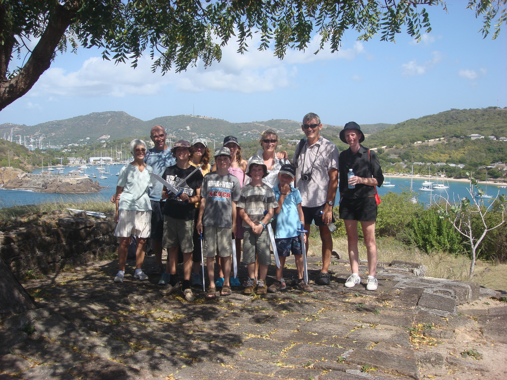
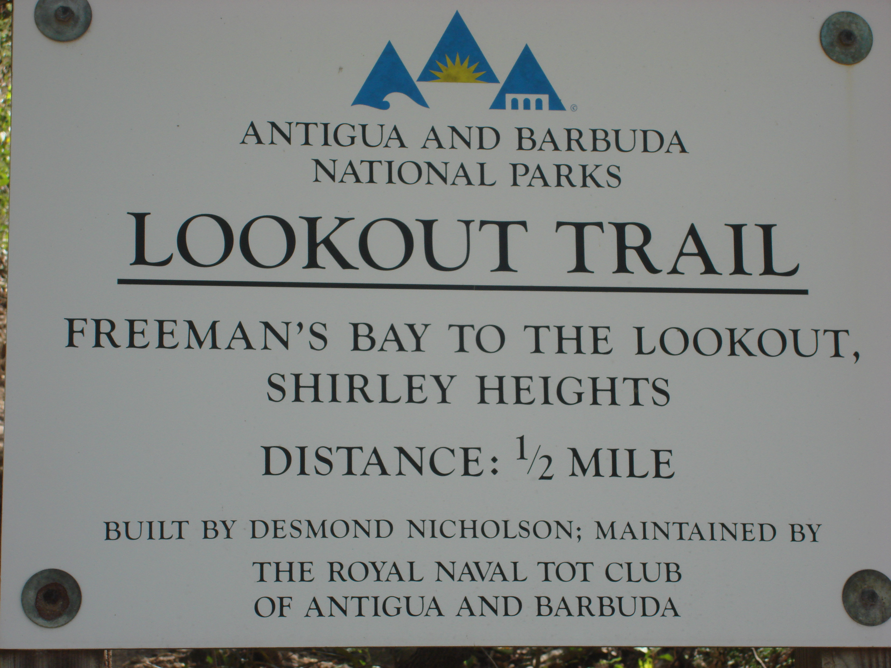
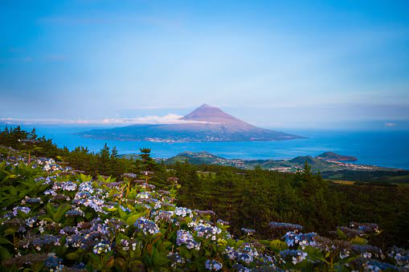
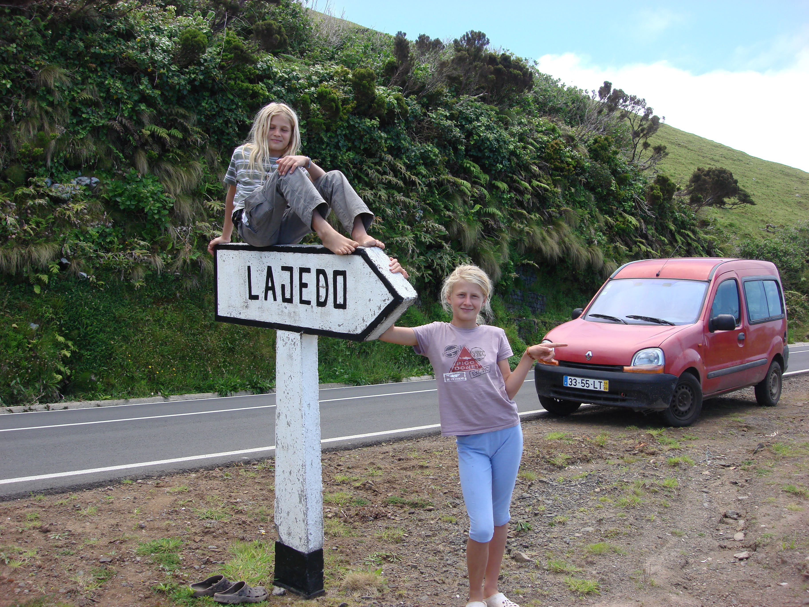
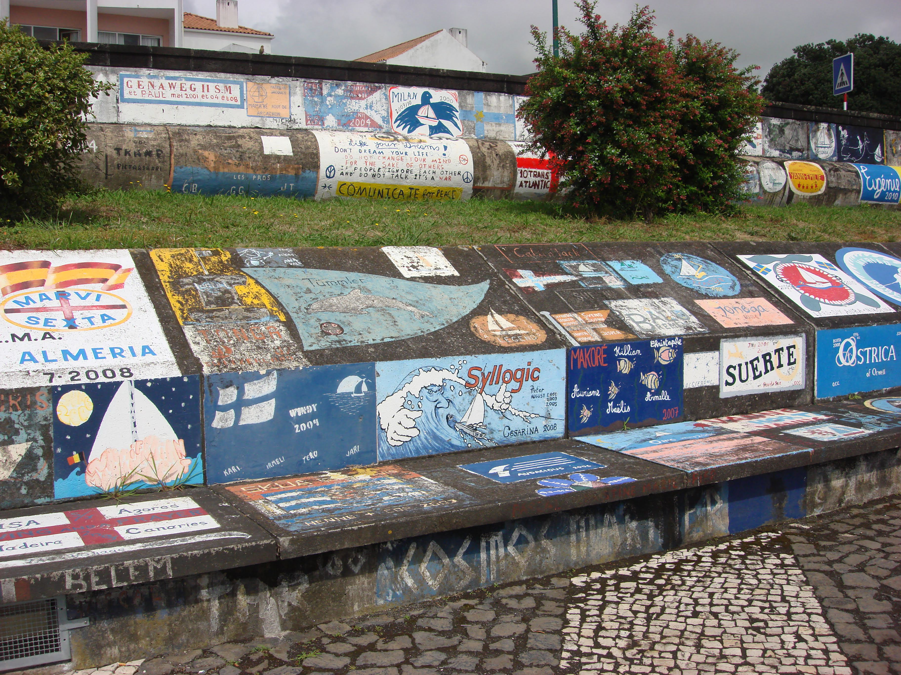

# Image Gallery Guide for All Pages

## Overview
Every page on your Kiah website now supports **clickable image galleries** with comments, navigation, and responsive design. The lightbox system is already loaded on all pages.

---

## Quick Start: Adding Images to Any Page

### Step 1: Find or Create a Gallery Section
All pages have a `<div class="gallery-grid">` container ready for images. Look for it in your HTML:

```html
<div class="gallery-grid">
    <!-- Add images here -->
</div>
```

If a page doesn't have one, add this snippet where you want images:

```html
<div class="gallery-grid">
    <!-- Add images here with data-gallery="page-name" -->
</div>
```

### Step 2: Add Images with Lightbox Attributes

```html

```

---

## Complete Examples by Page Type

### 🏠 Homepage (index.html)
```html
<div class="gallery-grid">
    
    
    
</div>
```

### 🧭 Place Pages (place-*.html)
Each place page already has a gallery-grid. Example for `place-azores.html`:

```html
<div class="gallery-grid">
    <!-- Azores Images -->
    
    
    
    
    
</div>
```

### 👥 Friends Page (friends.html)
Already populated with Jan & Max and Jim & Sharon galleries. Add more:

```html
<h2>New Friends Gallery</h2>
<div class="gallery-grid">
    
    
    
</div>
```

### 🦅 Eagle Page (eagle.html)
Already has gallery-grid ready:

```html
<div class="gallery-grid">
    
    
    
</div>
```

### 🛥️ Route Pages (routes-*.html)
```html
<div class="gallery-grid">
    <!-- Mediterranean highlights -->
    
    
    
</div>
```

### ⛳ Toddington Page (toddington.html)
Already has gallery-grid:

```html
<div class="gallery-grid">
    
    
    
</div>
```

---

## Attribute Reference

| Attribute | Required | Purpose | Example |
|-----------|----------|---------|---------|
| `src` | ✅ Yes | Image file path | `src="Images/Azores/photo.jpg"` |
| `alt` | ✅ Yes | Accessibility text | `alt="Harbor view"` |
| `data-gallery` | ✅ Yes | Gallery grouping | `data-gallery="azores"` |
| `data-caption` | ✅ Yes | Comment/description | `data-caption="Beautiful sunset"` |
| `width` | ⭕ Optional | Image display width | `width="200"` |
| `height` | ⭕ Optional | Image display height | `height="150"` |

---

## Gallery Naming Convention

Use consistent, descriptive names for `data-gallery`:

| Page Type | Gallery Name | Example |
|-----------|--------------|---------|
| Homepage | `home` | `data-gallery="home"` |
| Place pages | place name (lowercase) | `data-gallery="azores"` `data-gallery="malta"` |
| Routes | route name | `data-gallery="mediterranean-route"` |
| Friends | friend name | `data-gallery="jan-max"` `data-gallery="jim-sharon"` |
| Special pages | page name | `data-gallery="eagle"` `data-gallery="toddington"` |

---

## User Features (What Visitors Can Do)

✅ **Click** any image to open in fullscreen lightbox  
✅ **Navigate** with Previous/Next buttons or arrow keys (← →)  
✅ **Close** with X button, ESC key, or click background  
✅ **Read** image captions/comments displayed below each image  
✅ **See** image position counter (e.g., "3 of 12")  
✅ **Add comments** directly in the lightbox (saved in their browser)  
✅ **Works on** desktop, tablet, and mobile devices  
✅ **Keyboard accessible** for accessibility features  

---

## Lightbox Controls

### Mouse
- **Click image** → Opens lightbox
- **Click X button** → Closes
- **Click ❮ or ❯** → Previous/Next image
- **Click dark background** → Closes

### Keyboard
- **← Arrow Key** → Previous image
- **→ Arrow Key** → Next image
- **ESC Key** → Close lightbox

---

## Tips for Best Results

### Image Size & Quality
- **Recommended dimensions**: 200-400px wide, 150-300px tall
- **File format**: JPG (best for photos), PNG (for graphics)
- **Quality**: Use high-quality originals; they'll resize automatically
- **File size**: Keep under 2MB per image for faster loading

### Captions
- **Be descriptive**: "Sunset in Horta harbor" rather than "Beach"
- **Include context**: Location, date, people, or event
- **Personal touch**: Share your feelings: "Beautiful moment with Jan & Max"
- **Keep it reasonable**: 2-3 sentences max for readability

### Gallery Organization
- **One gallery per location/event**: Don't mix Mediterranean and Atlantic
- **Consistent naming**: Use lowercase, hyphens for multi-word names
- **Logical order**: Arrange images chronologically or by importance
- **Title it**: Add an `<h2>` above each gallery group

---

## Example: Complete Page with Multiple Galleries

```html
<!DOCTYPE html>
<html lang="en">
<head>
    <meta charset="UTF-8">
    <title>Places I've Been</title>
    <link rel="stylesheet" href="css/global.css">
    <link rel="stylesheet" href="css/routes.css">
    <script src="js/global.js" defer></script>
    <script src="js/lightbox.js" defer></script>
</head>
<body>
    <div id="header"></div>

    <h1>Our Mediterranean Journey</h1>
    
    <!-- Gallery 1: Gibraltar -->
    <h2>Gibraltar - Gateway to the Mediterranean</h2>
    <div class="gallery-grid">
        
        
    </div>

    <!-- Gallery 2: Malta -->
    <h2>Malta - Island Paradise</h2>
    <div class="gallery-grid">
        
        
    </div>

    <div id="footer"></div>
</body>
</html>
```

---

## Troubleshooting

**Images not clickable?**
- Verify `data-gallery` attribute is present
- Check that `js/lightbox.js` is loaded in `<head>`

**Comments not saving?**
- Comments are saved in browser storage (not online)
- Different browsers = different stored comments
- Clearing browser data will erase comments

**Images not displaying?**
- Check `src` path is correct (use forward slashes: `Images/path/image.jpg`)
- Verify image file exists in the specified folder
- Check file extension matches (`.jpg`, `.png`, etc.)

**Captions not showing?**
- Ensure `data-caption` attribute is present
- Check caption text is between quotes

---

## Summary

✨ **Every page is ready for images!** Just add `` tags with the four required attributes:
1. `src` - where the image is
2. `alt` - accessibility text
3. `data-gallery` - gallery grouping name
4. `data-caption` - your comment/description

That's all you need. The lightbox handles the rest! 🎉
